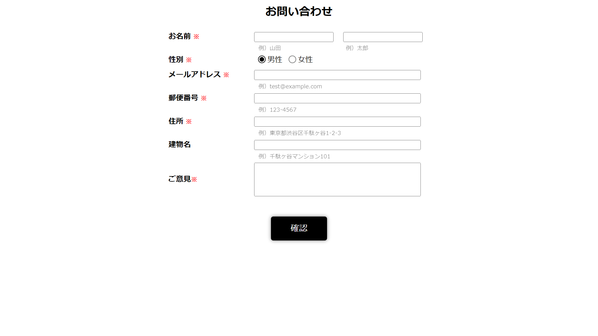
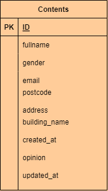

# 問い合わせ確認システム
顧客からの問い合わせを受け取り、様々な条件で検索してそれを確認することができる。

.png)

## 作成した目的
顧客の問い合わせの確認を容易にするため

## 機能一覧
- 個人情報入力機能
- 問い合わせ内容入力機能
- 問い合わせ内容確認機能
- 問い合わせ内容検索機能
- ページネーション

## 使用技術
- Laravel 8.x

## テーブル設計
.png)

## ER図

## 注意事項
- 顧客画面のルート('/')
- 確認画面のルート('/maker')